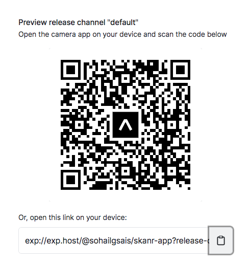

# Skanr

Using Google Cloud's Vision AI to display place details from images taken by camera

## Authors

- [@Github](https://www.github.com/SohailMG)

## Demo

## Lessons Learned

- Google Cloud Services
- Object recognition
- Optical Character Recognition
- Approximate String similarity algorithms
- React Native
- TailwindCss

## How to use

- Install Expo Go from App/Apple store
- Scan the QR code 

## Documentation

[Documentation](https://linktodocumentation)

